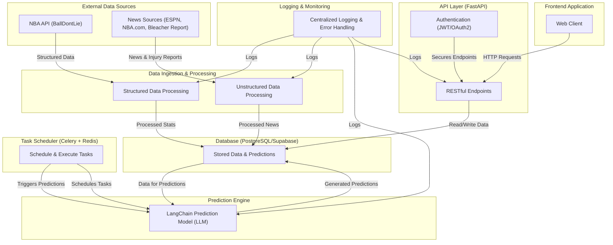

# BadBeats Backend API - Architecture Overview

**Version:** 0.1.0  
**Last Updated:** 02/27/2025

## Purpose

This document provides a comprehensive overview of the repository structure and the flow of data and control in the BadBeats Backend API. It uses a detailed Directed Acyclic Graph (DAG) representation to illustrate how different modules interact and how data flows from external sources through ingestion and prediction generation, then to API serving and finally to the front end.

## High-Level Architecture Diagram

Below is the detailed Mermaid diagram that represents the overall project architecture:

