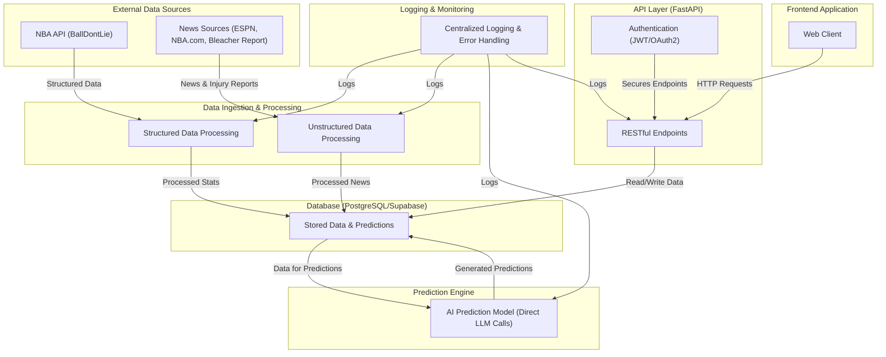

# BadBeats Backend API - Architecture Overview

**Version:** 0.1.0  
**Last Updated:** 02/27/2025

## Purpose

This document provides a comprehensive overview of the repository structure and the flow of data and control in the BadBeats Backend API. It uses a detailed Directed Acyclic Graph (DAG) representation to illustrate how different modules interact and how data flows from external sources through ingestion and prediction generation to API serving and the frontend.

## High-Level Architecture Diagram

Below is the detailed Mermaid diagram representing the current project architecture:

## Component Descriptions

- **External Data Sources**: 
  - **NBA API (BallDontLie)**: Provides structured data such as game schedules, team stats, and player stats.
  - **News Sources**: Supplies unstructured data (news articles, injury reports) from ESPN, NBA.com, and Bleacher Report.

- **Data Ingestion & Processing**:
  - **Structured Data Processing**: Fetches and processes NBA data via `ball_dont_lie_api.py`, storing it in Supabase daily.
  - **Unstructured Data Processing**: Scrapes and preprocesses news and injury data via `news_ingestion.py` for LLM use.

- **Database (PostgreSQL/Supabase)**: Stores historical game data and predictions in tables like `games` and `predictions`.

- **Prediction Engine**: 
  - **AI Prediction Model**: Uses direct OpenAI API calls (`prediction_model.py`) to generate ATS predictions, replacing the previous LangChain-based approach for simplicity.

- **API Layer (FastAPI)**:
  - **RESTful Endpoints**: Exposes predictions and health checks via routes in `api/`.
  - **Authentication**: Secures endpoints with JWT/OAuth2 implemented in `core/auth.py`.

- **Logging & Monitoring**: Centralized logging via `core/logger.py` captures API requests, errors, and prediction details.

- **Frontend Application**: A web client (not implemented here) consumes the API over HTTP.

## Data Flow

1. **Ingestion**: External data (structured from BallDontLie, unstructured from news sources) is fetched daily and processed by ingestion services.
2. **Storage**: Processed data is stored in Supabase, updating the `games` table with historical data and preparing for predictions.
3. **Prediction**: The workflow (`prediction_workflow.py`) retrieves upcoming games, prepares data, and generates predictions using the AI model, storing results in the `predictions` table.
4. **API Serving**: FastAPI endpoints read from the database, secured by JWT, and serve predictions to the frontend.
5. **Monitoring**: All steps are logged for debugging and performance tracking.

This simplified architecture eliminates background task scheduling (previously handled by Celery) in favor of a synchronous workflow triggered manually or via external scheduling (e.g., cron).